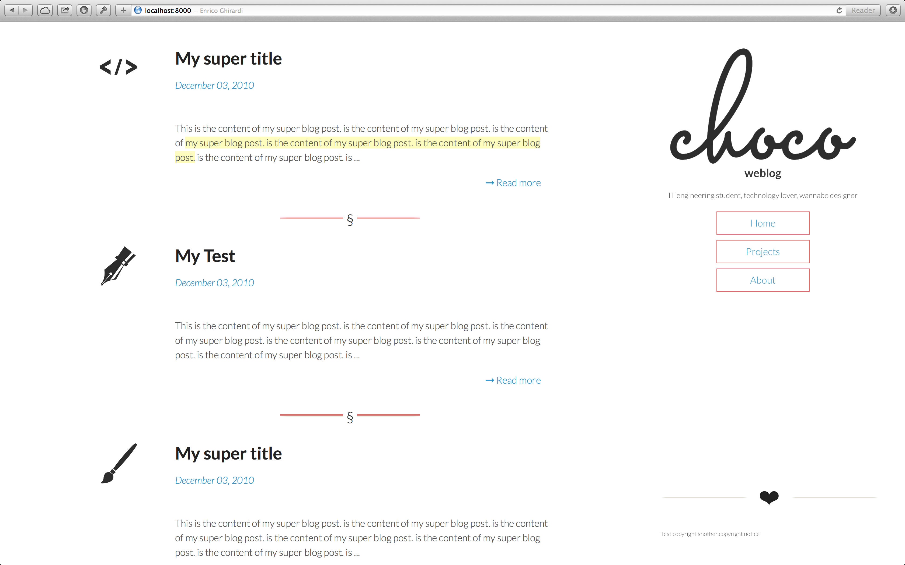
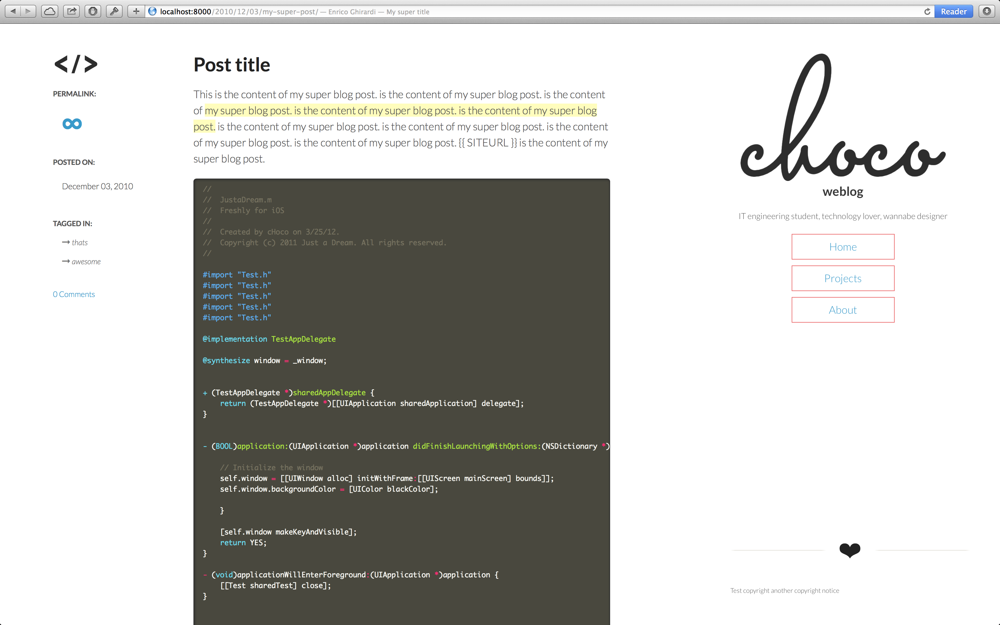
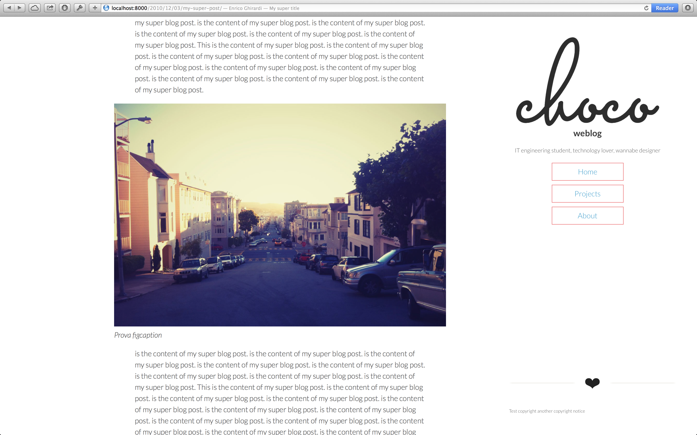
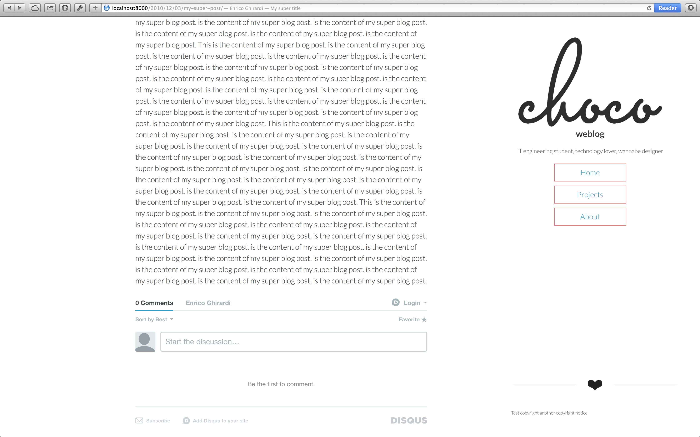
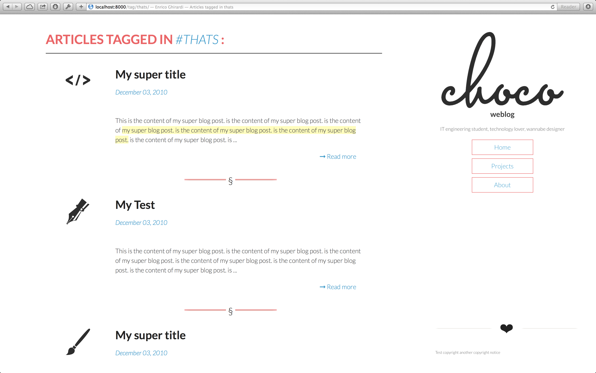
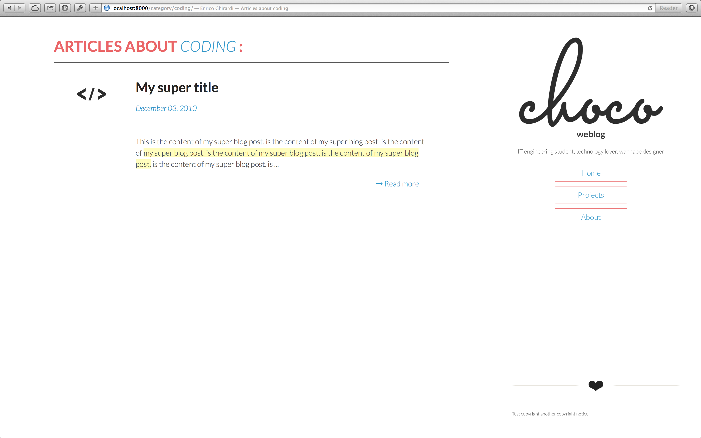

# Lighty

A very simple, light and fully responsive theme for Pelican written in HTML5 and CSS3.

#Screenshots

- Homepage

- Post - top

- Post - image

- Post - comments

- Tagged posts

- Post categories

# Contact

You can follow me on twitter, http://twitter.com/icHoco,
at my website http://choco.me 
or you can mail me at i@choco.me

# Copyright and License

Copyright 2012 Enrico "cHoco" Ghirardi

Licensed under the Apache License, Version 2.0 (the "License");
you may not use this work except in compliance with the License.
You may obtain a copy of the License in the LICENSE file, or at:

http://www.apache.org/licenses/LICENSE-2.0

Unless required by applicable law or agreed to in writing, software
distributed under the License is distributed on an "AS IS" BASIS,
WITHOUT WARRANTIES OR CONDITIONS OF ANY KIND, either express or implied.
See the License for the specific language governing permissions and
limitations under the License.
